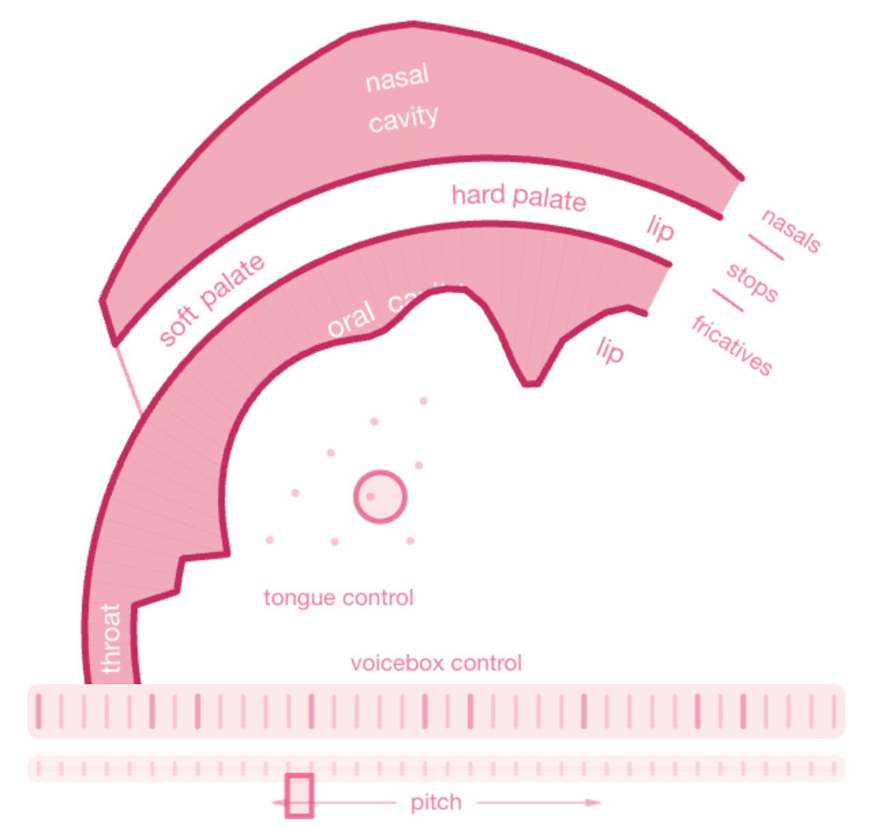

# Samuel

[Samuel](https://samuel.vvolhejn.com/) is a model that learns to control this silly mouth to mimic speech. Say something and it will parrot after you, or if you're shy, try one of the pre-made clips.

The mouth itself is [Pink Trombone](https://dood.al/pinktrombone/), a project originally by Neil Thapen, described by him as "bare-handed speech synthesis".

[**Try it here**](https://samuel.vvolhejn.com/)

## How it works

Details on how this model was trained will be published soon.
For now, feel free to poke around the codebase.

## License

Samuel is licensed under the **GNU General Public License v3.0** (see `LICENSE`).

`Pink-Trombone/` is a modified version of https://github.com/zakaton/Pink-Trombone/,
itself a programmable version of [Neil Thapen's original Pink Trombone](https://dood.al/pinktrombone/).
